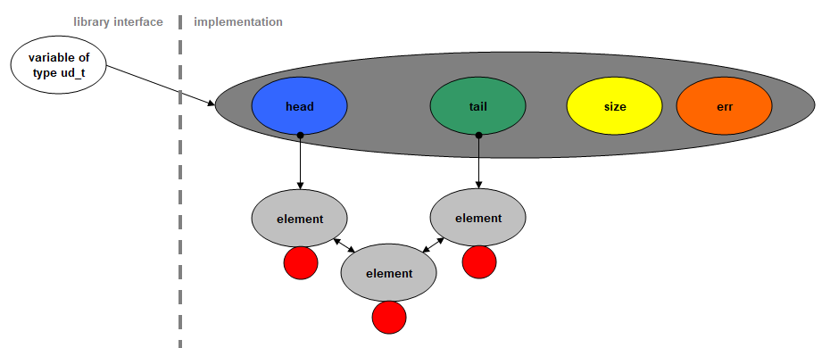
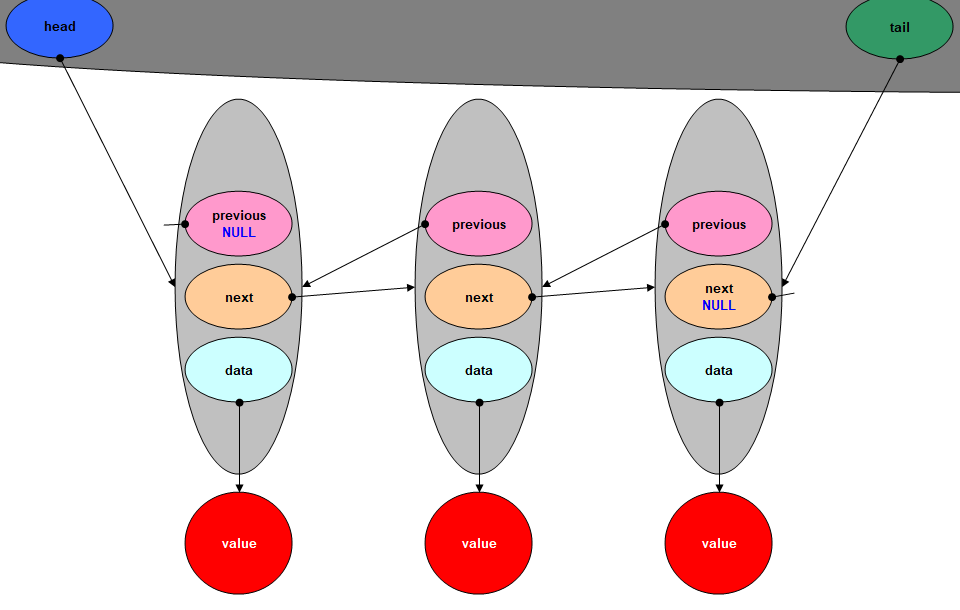

# uni_deque
C Deque Library

## The interface
Even if a Deque performs best only if you access the begin or the end of the list, this library also allows you to insert and access values at any position in the list, to enumerate a range of the list, to reverse the list, to sort the list, to insert sorted, to search for values, ...

In addition to the general functions which can be used for any kind of data, the library contains functions that are already specialized for basic types (characters, integers, floating points) and null-terminated strings (char* and wchar_t*).

Function names for data processing consist of key words that explain their purpose:
- Push
  - add a new element at the beginning or end of the list
- Insert
  - insert a new element at a certain position in the list
- Pop
  - delete an element at the beginning or end of the list
- Erase
  - delete an element at a certain position in the list
- Remove
  - delete an element that contains a certain value
- Front
  - access the begin of the list
- Back
  - access the end of the list
- At
  - access an element at a certain position in the list
- Sort
  - sort the list
- Asc
  - ascending order
- Desc
  - descending order
- Find
  - search the index of an element that contains a certain value

Specialized functions have an appendix that indicates the type that the function was made for.  
**List of appendixes:**

| Appendix | Represented Type
| -------- | ---
| C        | char
| SC       | signed char
| UC       | unsigned char
| S        | short
| US       | unsigned short
| I        | int
| UI       | unsigned int
| L        | for long
| UL       | unsigned long
| LL       | long long
| ULL      | unsigned long long
| F        | float
| D        | double
| LD       | long double
| Str      | null-terminated string of char
| WStr     | null-terminated string of wchar_t

Examples:

The name of the function to add an int at the beginning of a Deque of int is  
`PushFrontI`

The name of the function to insert a double into an ascending-sorted Deque of double is  
`InsertAscD`

The comments in the first 250 lines of "uni_deque.h" should give you all the information you need to work with the library. The "main.c" file contains two examples of how to use the library. One for long int values and one for null-terminated strings.

## uni_deque Quick Reference

### Frame Functions
| Function     | Brief
| ------------ | ---
| UDOpen       | Open a new deque.
| UDSize       | Returns the number of elements.
| UDEmpty      | Test whether the deque is empty.
| UDFailed     | Test whether the previous operation failed.
| UDDeleteData | Deallocate memory used for a value.
| UDClose      | Recursively deallocate memory used in the deque.

### Generalized Functions
| Function       | Brief
| -------------- | ---
| UDPushFront    | Add element at the beginning.
| UDPushBack     | Add element at the end.
| UDInsert       | Insert element.
| UDFront        | Access first element.
| UDBack         | Access last element.
| UDAt           | Access element at the specified index.
| UDPopFront     | Delete first element.
| UDPopBack      | Delete last element
| UDErase        | Delete element at the specified index.
| UDRemove       | Delete element with the specified value.
| UDReverse      | Reverse the order of elements.
| UDForEach      | Apply function to a range of elements.
| UDSort         | Sort elements.
| UDInsertSorted | Insert into a sorted deque.
| UDFind         | Search a specified value.

### Specialized Functions
| Function        | Brief
| --------------- | ---
| UDPushFront...  | Add element at the beginning.
| UDPushBack...   | Add element at the end.
| UDInsert...     | Insert element.
| UDFront...      | Access first element.
| UDBack...       | Access last element.
| UDAt...         | Access element at the specified index.
| UDPopFront...   | Delete first element.
| UDPopBack...    | Delete last element
| UDErase...      | Delete element at the specified index.
| UDRemove...     | Delete element with the specified value.
| UDReverse...    | Reverse the order of elements.
| UDForEach...    | Apply function to a range of elements.
| UDSortAsc...    | Sort elements in ascending order.
| UDSortDesc...   | Sort elements in descending order.
| UDInsertAsc...  | Insert into an ascending-sorted deque.
| UDInsertDesc... | Insert into a descending-sorted deque.
| UDFind...       | Search a specified value.

The ellipsis is a placeholder for `C` to `WStr` as described in the list of appendixes for specialized functions.  

### Types
| Type                   | Brief
| ---------------------- | ---
| ud_t                   | Type of a pointer to an object containig information to control the deque.
| ud_ssize_t             | Signed integral type.
| ud_size_t              | Unsigned integral type
| ud_for_each_proc_t \*) | Type of a callback function passed to UDForEach().
| ud_cmp_t \*\*)         | Type of a callback function passed to UDSort(), UDInsertSorted(), UDFind(), and UDRemove().

\*) Declaration of a callback function:  
`int ForEachCallback(void *p_data, void *user_parameter);`  
ForEachCallback is a placeholder for the application-defined function name.  
The first parameter is the pointer to the data saved in the deque element.  
The second parameter gets the pointer passed to the last parameter of UDForEach().  
Return a non-zero value to continue the enumeration or zero otherwise.  
*NOTE* The behavior is undefined if the callback function alters the number of elements or their order in the deque.  

\*\*) Declaration of a callback function:  
`int CmpCallback(const void *p_data_1, const void *p_data_2);`  
CmpCallback is a placeholder for the name of an application-defined function that compares two values.  
Return a value less than zero if the first value comes before the second.  
Return a zero value if both values are equal.  
Return a value greater than zero if the first value comes after the second.  

### Macros
| Macro                   | Brief
| ----------------------- | ---
| PRI_UD_SIZE(spec) \*)   | fprintf macro for format conversion of library-specific integer types.
| SCN_UD_SIZE(spec) \*\*) | fscanf macro for format conversion of library-specific integer types.
| UD_TYPE \*\*\*)         | To use wrapper macros, define UD_TYPE to either of appendixes of the specialized functions. Default is `I`.
| UD_INVALID_IDX          | Return value of UDFind() if the function failed.

\*) Valid specifiers are i, d, u, x, and X to be passed to the macro.  
\*\*) Valid specifiers are i, d, u, and x to be passed to the macro.  
\*\*\*) Valid values are `C` to `WStr` as described in the list of appendixes for specialized functions. Define this macro before including "uni_deque.h" in order to use these as a replacement for the functions of this library.  

### Wrapper Macros
| Macro       | Brief
| ----------- | ---
| OPEN        | replacement for UDOpen
| SIZE        | replacement for UDSize
| EMPTY       | replacement for UDEmpty
| FAILED      | replacement for UDFailed
| DELETE_DATA | replacement for UDDeleteData
| CLOSE       | replacement for UDClose
| PUSH_FRONT  | replacement for UDPushFront...
| PUSH_BACK   | replacement for UDPushBack...
| INSERT      | replacement for UDInsert...
| FRONT       | replacement for UDFront...
| BACK        | replacement for UDBack...
| AT          | replacement for UDAt...
| POP_FRONT   | replacement for UDPopFront...
| POP_BACK    | replacement for UDPopBack...
| ERASE       | replacement for UDErase...
| REMOVE      | replacement for UDRemove...
| REVERSE     | replacement for UDReverse
| FOR_EACH    | replacement for UDForEach
| SORT_ASC    | replacement for UDSortAsc...
| SORT_DESC   | replacement for UDSortDesc...
| INSERT_ASC  | replacement for UDInsertAsc...
| INSERT_DESC | replacement for UDInsertDesc...
| FIND        | replacement for UDFind...

The ellipsis is a placeholder for `C` to `WStr` as described in the list of appendixes for specialized functions. Macro `UD_TYPE` defines which appendix is used. Default is `I`.  

## A little background information about the implementation
A Deque unites the functionality of a Stack and a Queue. That means a Deque holds the pointer to the first element `head` and a pointer to the last element `tail` of a container for the values to save. Aditionally this implementation maintains the number of saved values `size` and an error indicator `err`. Only a pointer of type `ud_t` is needed as interface referencing the Deque.
Schema:

The container for the values is a doubly-linked list. Besides of the pointer to the `previous` element and the `next` element it holds a pointer `data` to the actual value. This value can be of any type but should be the same for each element in a Deque because there will be no information about the memory size saved that `data` points to.
Schema of the linked list:

